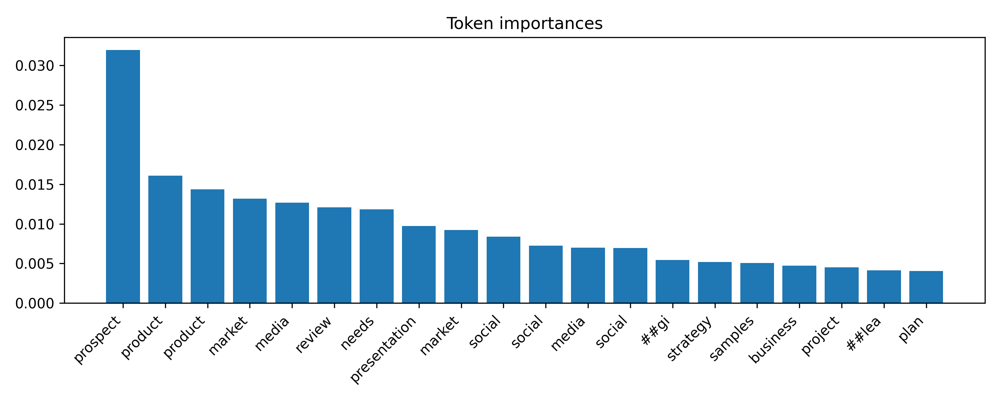

# Spreasheets Analysis: Classification & Summarization

In this project, we develop a BERT-based approach for interpreting the semantic content of Excel spreadsheets. Understanding spreadsheet text enables automated file categorization, efficient information retrieval, and concise table summarization by identifying the most informative headers and entries.

The implemented pipeline performs three core functions:

1. Preprocessing and extraction of textual information from Excel and CSV files.

2. Fine-tuning a BERT model to classify spreadsheet content based on the extracted text from the step above.

3. Summarizing spreadsheets using BERT's attention scores associated with the final-layer `[CLS]` token.

## Reproducibility

Download the data using the links listed in each folder’s `desc.txt` file inside the `data` directory.

Run `make build-run` to build the Docker image (packages defined in `requirements.txt`) and start the container.

Inside the container:

- Use `dataset_preparation.ipynb` to visualize the extracted table text and generate datasets for BERT fine-tuning.
- Fine-tune BERT via:  
  `python train.py --config config.yaml`
- For spreadsheet summarization, refer to `sheet_content_summarization.ipynb`, which includes examples for all spreadsheets.

## Data

This section summarizes the preprocessing utilities implemented in `utils.py`.

### `read_excel_tables()`

Both CSV and Excel files are normalized into a consistent text representation.

- **CSV files:** Loaded directly with pandas; each file yields one table.
- **Excel files:**
  - A binary mask identifies all non-empty cells.
  - Under two assumptions—(i) the first non-empty row of a block is the header; (ii) distinct tables are separated by at least one fully empty row—contiguous non-empty row segments are extracted as table candidates.
  - Blocks with fewer than two rows are discarded.
  - The first row becomes the header. Column names are deduplicated when needed.
  - Empty rows/columns are removed, and the table is reindexed.
  - A single sheet may yield multiple tables.

### Converting Tables to BERT Input

Because BERT operates on linear text, each table is transformed into a compact textual summary preserving its semantics.

#### `infer_col_type()`

Assigns each column a type—`percent`, `currency`, `numeric`, `date`, `text`, or `categorical`—using cues such as `%`, currency symbols, numeric patterns, and uniqueness ratios.

#### `top_values()`

For text or categorical columns, the most frequent values are extracted to help characterize table content.

#### `keyword_bag()`

Tokenizes and normalizes all table text (lowercasing, cleaning, stopword removal, stemming with NLTK). Word frequencies are aggregated with additional weight on header tokens. The top-K tokens form the table-level keyword list.

#### `representative_rows()`

Each row is scored by its number of unique tokens. The top-K rows serve as concise structural examples of the table.

#### `sheet_to_text()`

Assembles all extracted components—column descriptions, frequent values, keywords, representative rows—into a single textual block. This block is the final input to BERT.

Examples are provided in `dataset_preparation.ipynb`.

## BERT Fine-Tuning

Model training uses PyTorch, Hugging Face Transformers, and PyTorch Lightning. Due to dataset size, we verify correctness through a controlled one-batch overfitting experiment (10 epochs), ensuring loss decreases and the pipeline functions end-to-end.

## Summarization

Summarization is derived from the final-layer attention weights of the `[CLS]` token. These weights indicate which tokens BERT considers most influential.

Procedure:

1. Extract `[CLS]` attention scores for all tokens.
2. Sort scores in descending order.
3. Remove special tokens such as punctuation, `[PAD]`, and `[SEP]`.
4. Rank the remaining informative tokens.
5. Score rows and columns by counting their occurrences of high-importance tokens.
6. Select the highest-scoring rows and columns as the spreadsheet summary.

Example attention visualization (University of Illinois course catalog):

Additional examples are available in `sheet_content_summarization.ipynb`.

---

**Note:** This project was implemented with assistance from GPT-5.
